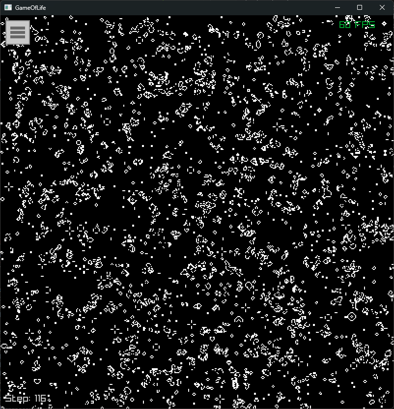
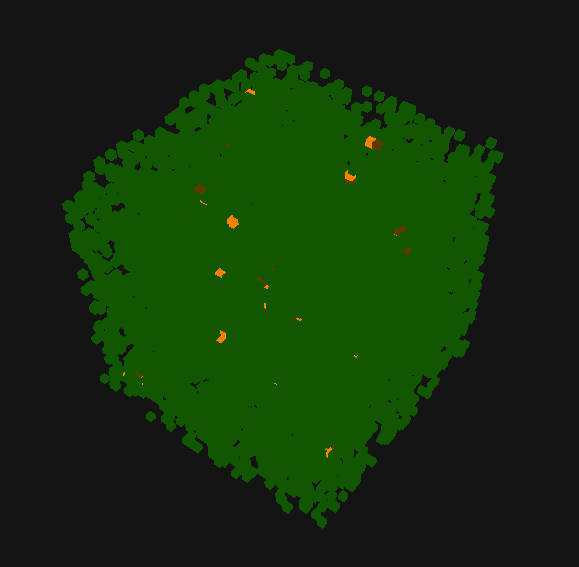
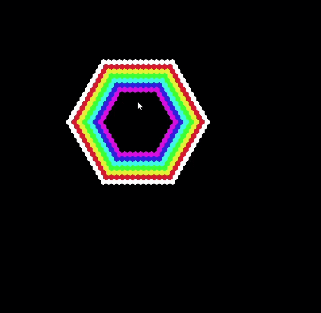

# Carl: Cellular Automata Rule Language

Carl is a domain-specific language for defining cellular automata. It compiles `.carl` files into executables that simulate and visualize the automaton using [Raylib](https://www.raylib.com/).

## Features

- Custom DSL for cellular automata
- N-dimensional automata
- Moore, Von Neumann or hexagonal neighborhoods
- Executable generation
- Real-time visualization with Raylib (requires OpenGL 3.3+)

## Prerequisites

- [Swift](https://www.swift.org/install/) 6.0+
- **Linux** : install the [system libraries required by Raylib](https://github.com/raysan5/raylib/wiki/Working-on-GNU-Linux).

## Installation

```bash
git clone https://github.com/GDbateaux/330.1-bachelor-thesis.git
cd 330.1-bachelor-thesis
```

> **Windows users** : Swift Package Manager uses symlinks for dependencies. Enable **Developer Mode** (Settings → For developers) and run `git config --global core.symlinks true`.

## Usage

```bash
swift run Carl path/to/file.carl -o my-automaton
./my-automaton
```
> **First build is slow** : Carl compiles Raylib from C sources.

### Command-line options

| Option                | Description                                                                                  |
| --------------------- | -------------------------------------------------------------------------------------------- |
| `<source-file>`       | Path to the Carl source file (`.carl`).                                                      |
| `-o`, `--output`      | Output executable path.                                                                      |
| `-g`, `--grid-length` | Grid size along each dimension. Defaults to `200` for 2D automata and `20` for 3D or higher. |
| `--steps-per-frame`   | Number of simulation steps between texture updates (2D only). Defaults to `1`.               |
| `--clean`             | Clean the build cache before recompiling.                                                    |

### Simulation controls

| Key / control | Action |
| --- | --- |
| `Space` | Pause or resume the simulation. |
| `Right Arrow` | Advance by one step when the simulation is paused. |
| `Left Arrow` | Go back by one step when the simulation is paused. |
| `E` | Toggle edit mode (only in 3d). In edit mode, the simulation is paused. |
| `Up Arrow` / `Down Arrow` | Change the active layer in edit mode (3D automata). |
| Left mouse drag | Pan the camera when not in edit mode. |
| Mouse wheel | Zoom in or out |
| Right mouse button | Cycle the state of a cell (in 3d only in edit mode). |
| Menu button (top-left) | Open the state/color menu and pause the simulation. |

## Language documentation

See [docs/DSL_design.md](docs/DSL_design.md) for the language specification, EBNF grammar and examples.

## Running tests

Carl includes unit tests covering the lexer, parser, semantic analysis, and other compiler components.

Run all tests with:

```bash
swift test
```

## Example

### Game of Life

```carl
automaton GameOfLife {
    world {
        states { Dead, Alive }
        neighborhood: Moore(1)
        dimension: 2
    }
    initial {
        Dead: 0.7
        Alive: 0.3
    }
    rules {
        Dead -> Alive when count_neighbors(Alive) == 3
        Alive -> Dead when count_neighbors(Alive) < 2 or count_neighbors(Alive) > 3
    }
}
```

More examples in the [examples](examples) directory.

## Project Structure

```
.
├──.github/workflows/  
│  └── ci.yml                     # CI: build & test on ubuntu/macos/windows  
├──docs/                          # Language documentation and README images
│  └── DSL_design.md              # Language specification + EBNF grammar  
├──examples/                      # Example .carl programs  
├──Sources/  
│  ├── Carl/                      # Carl compiler  
│  │   ├── Carl.swift             # CLI entry point 
│  │   ├── CodeGen/               # Swift code generation  
│  │   │   ├── NDGrid.swift       # N-dimensional grid
│  │   │   └── SwiftGenerator.swift # AST → Swift source  
│  │   ├── Compiler.swift         # Compilation pipeline orchestrator  
│  │   ├── Parser/  
│  │   │   ├── AST.swift          # AST node definitions  
│  │   │   ├── Error.swift        # Compiler error types  
│  │   │   ├── Lexer.swift        # Lexical analysis  
│  │   │   ├── Parser.swift       # Syntactic analysis
│  │   │   └── Token.swift        # Token definitions  
│  │   └── Semantic/  
│  │       └── SemanticAnalyzer.swift # Semantic analysis  
│  └── CRaylib/                   # Raylib C
├──Tests/                         # Compiler unit tests
├──Package.resolved
├──Package.swift
├──README.md
└── .gitignore  
```

## Preview







## Credits

- The README were built with assistance from Opencode's Big Pickle model
- [Raylib](https://www.raylib.com/) used for visualization
